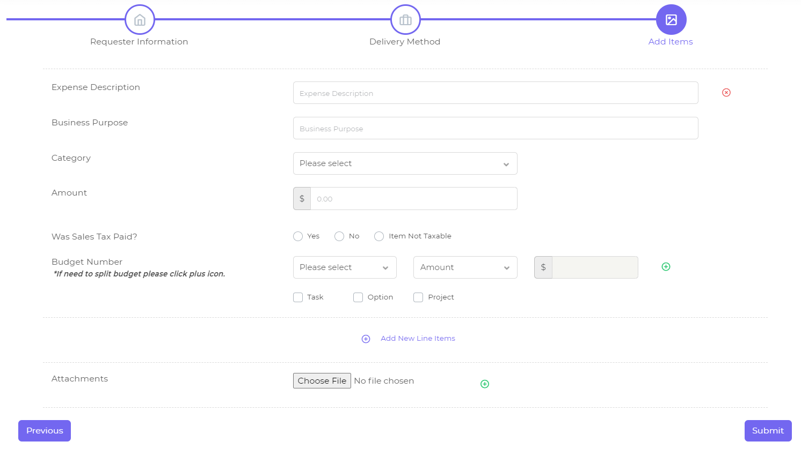

# Administrative and Financial Web Portal

This is a web application built for University of Washington College of Engineering to manage their daily transaction duties. Currently our website is deployed on the UW testing server: http://v2227.host.s.uw.edu/

## Technologies

### Front-end

For front-end, we use [Vuexy HTML Admin Template](https://pixinvent.com/demo/vuexy-html-bootstrap-admin-template/documentation) which is built based on [Bootstrap4](https://getbootstrap.com/) as a framework.

### Back-end

The only task of our back-end work is to provide API for front-end pages. We use [Node.js](https://nodejs.org/en/) and two important [npm](https://www.npmjs.com/) libraries [Express](http://expressjs.com/) and [Mongoose](https://mongoosejs.com/) . Express is a great web framework and it's helpful for routing design. And since we build our database with [MongoDB](https://www.mongodb.com/), so that we use Mongoose to manage and control the data.

## Features

In general we have four access levels. The functions of each access level are shown as below. Before that we have two attributes to claim.

* **Unit**. Defined based on different departments. For example, Electrical and Computer Engineering (ECE) department is a unit, Chemical Engineering (CE) is another unit. Both **Fiscal Staff** and **Administrator** are defined in a scope of unit.

* **Subunit**. Defined based on different laboratories. For example, Network Security Lab is a subunit under ECE unit. Both **Submitter** and **Approver** are defined in a scope of subunit.

*Notice: Although in the above example we say "Network Security Lab is a subunit under ECE unit", we don't have any actual affiliations between subunit and unit in our code. For Fiscal Staff and Administrator, we only have the attribute "Unit". Likewise, for Submitter and Approver, we only have the attribute "Subunit".*

| Access Level  | What They Can Do                                             |
| ------------- | ------------------------------------------------------------ |
| Submitter     | The most basic level, users with this level can submit and track their own requests. |
| Approver      | Approvers are users who have the right to approve (or send back) certain budget numbers of requests under his/her own subunit. Notice that we assign approvers by budget numbers, not just the requests, which means for a request, there might be different approvers if this request contains several budget numbers, one budget number may need approvals from several approvers, one approver may be able to approve several budget numbers. Only all approvers approved a certain budget number, it will be considered approved, and only all budget numbers of this request are approved, this request is considered approved. |
| Fiscal Staff  | Users in this access level can see all requests under his/her unit, and after a request is approved they can take it, then they're able to accept it (which means this request is claimed, but not completed yet) and then mark this request as completed. |
| Administrator | This is the highest level currently, users in this level can do some unit-level settings, like authorizing new users, assigning budget numbers to approvers. |

*Notice: Approvers will be assigned automatically when a request submit, based on Administrator's settings, and they can only see the requests that assigned to them. Fiscal Staffs can see all requests under their own unit, and they can take/untake/reassign a request if that's available, which means the assignment of Fiscal Staff is controlled by users themselves.*

### Request

Requests are definitely the most important element of our system. Basically we have six kinds of requests in total, four general types: reimbursement, purchase request, procard receipt, pay an invoice and two types related to travel: travel request and travel reimbursement. 

#### Lifecycle

A typical lifecycle for a request (which means there's no send back or untake or reassign these "accidental" operations) is like this:

```
submitted -> approved -> taken by a certain fiscal staff -> accepted -> completed
```

But during this process, there might be other actions which may lead the request go back to a previous status. So here we listed all possible actions tied to a request below.

| Pre-Status        | Action                   | Post-Status                   | Operator     | Notes                                                        |
| ----------------- | ------------------------ | ----------------------------- | ------------ | ------------------------------------------------------------ |
| *Not Applicable*  | Submit                   | Awaiting Approval             | Submitter    | Marks the beginning of the lifecycle for a request.          |
| Awaiting Update   | Update                   | Awaiting Approval or Approved | Submitter    | When the status is Awaiting Update, that means this request is sent back by Approver or Fiscal Staff, so submitter have to modify some contents and submit it again. |
| Awaiting Approval | Approve                  | Approved                      | Approver     | Only when the status is Awaiting Approval, approvers have the right to approve or send back this request. |
| Awaiting Approval | Send Back                | Awaiting Update               | Approver     | If the request is sent back by Approver, the lifecycle of this request will be restart after update. |
| Approved          | Take / Untake / Reassign | *Status will not be changed*  | Fiscal Staff | Only when the status change to Approved, Fiscal Staff have the right to take this request. If this request is not taken by others, they can take it. Then they can untake it or reassign it to others. |
| Approved          | Accept                   | Accepted                      | Fiscal Staff | Only when Fiscal Staff "take" this request, he/she has the right to accept or send back this request. |
| Approved          | Send Back                | Awaiting Update               | Fiscal Staff | If Fiscal Staff want to send back this request, the status will change to Awaiting Update. |
| Accepted          | Complete                 | Completed                     | Fiscal Staff | Only when a request "accept" by Fiscal Staff, they have the right to "complete" it. This marks the end of the lifecycle for a request. |

*Notice: Why there are two possible post-status when a request is updated by submitter? That because when a Fiscal Staff send back a request, there are two options for them: Bypass Approvers or Require Re-approval. If they pick the former one, that means this request won't need the approval again, so the request status will become Approved directly after update. And if they pick the latter one, that means the lifecycle of this request need to be restart, so that the request status will become Awaiting Approval.*

#### Line Item

For the four general request types, we use [jQuery Steps](http://www.jquery-steps.com/) to make sure them look like in the same format. Some of them are different with each other in step 1 and step 2, but all of them have nearly the same content in step 3, which we called as *Line Item*. Within a request users can create any numbers of line item, so that we have *Add New Line Items* button below the line item block. Also we have a delete button at the most right of the first line of each line item block, so that users can delete the whole block if they'd like to. For attachments we put it at the very last line, and we also allows users to upload multiple documents. 



An important element within a line item is the **budget number**. Users can split budget by amount or percentage. For example, the total amount is $100, and you want to reimburse $50 on budget number 910-88, and reimburse another $50 on budget number 920-88. The split value input box for the last budget number will always be disabled, it will calculate automatically by the total amount and previous split value users type in, to make sure the budget number split in a correct way.

Also we use [jQuery Validation](https://jqueryvalidation.org/) to create the validation rule for each request.

#### Detail Page

The request detail page should be look like the same for all access levels. We split the request detail page into three modules, which uses three `.js` files to control.